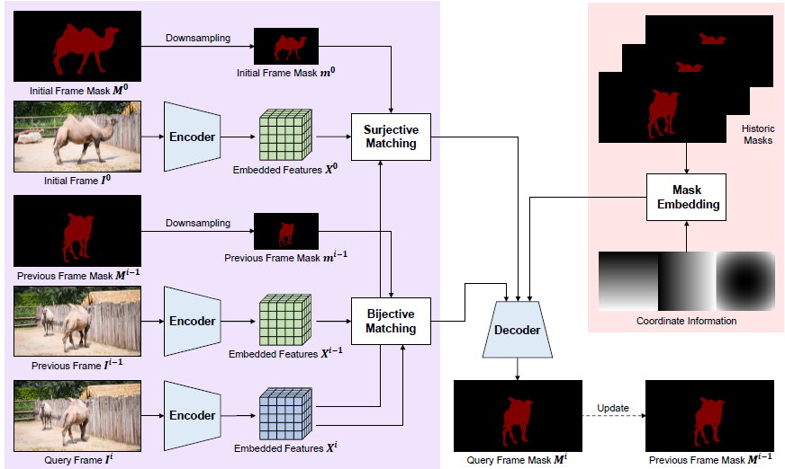

## Pixel-Level Bijective Matching for Video Object Segmentation (WACV 2022)
#### Suhwan Cho, Heansung Lee, Minjung Kim, Sungjun Jang, Sangyoun Lee
----

### - Benchmark Results
[](https://paperswithcode.com/sota/visual-object-tracking-on-davis-2016?p=pixel-level-bijective-matching-for-video)<br>
[](https://paperswithcode.com/sota/visual-object-tracking-on-davis-2017?p=pixel-level-bijective-matching-for-video)<br>
[](https://paperswithcode.com/sota/semi-supervised-video-object-segmentation-on-1?p=pixel-level-bijective-matching-for-video)<br>
[](https://paperswithcode.com/sota/video-object-segmentation-on-youtube-vos?p=pixel-level-bijective-matching-for-video)


### - Architecture



### - Download
[[arXiv paper]](https://arxiv.org/pdf/2110.01644.pdf)

[[pre-computed results]](https://drive.google.com/file/d/1po2WCeSr8Xltkn3y_NgohZglKfPu3xZp/view?usp=sharing)

[[pre-trained model on DAVIS]](https://drive.google.com/file/d/15SXF3eVYQ8Pu9bT_gjwir0wOvul599pE/view?usp=sharing)

[[pre-trained model on YouTube-VOS]](https://drive.google.com/file/d/1VrJiou7SJOqwrGiPdEh3Ix6Vzr7OV3gQ/view?usp=sharing)


### - Usage
1. Define the paths in 'local_config.py'.

2. Select the pre-trained model and testing dataset by modifying 'main_runfile.py'.

3. Run BMVOS!
```
python main_runfile.py
```


### - Citation
If you find our paper or this repo useful, please cite our paper :)
```
@article{cho2021pixel,
  title={Pixel-Level Bijective Matching for Video Object Segmentation},
  author={Cho, Suhwan and Lee, Heansung and Kim, Minjung and Jang, Sungjun and Lee, Sangyoun},
  journal={arXiv preprint arXiv:2110.01644},
  year={2021}
}
```


### - Note
Code and models are only available for non-commercial research purposes.

If you have any questions, feel free to contact me!
```
E-mail: chosuhwan@yonsei.ac.kr
```
